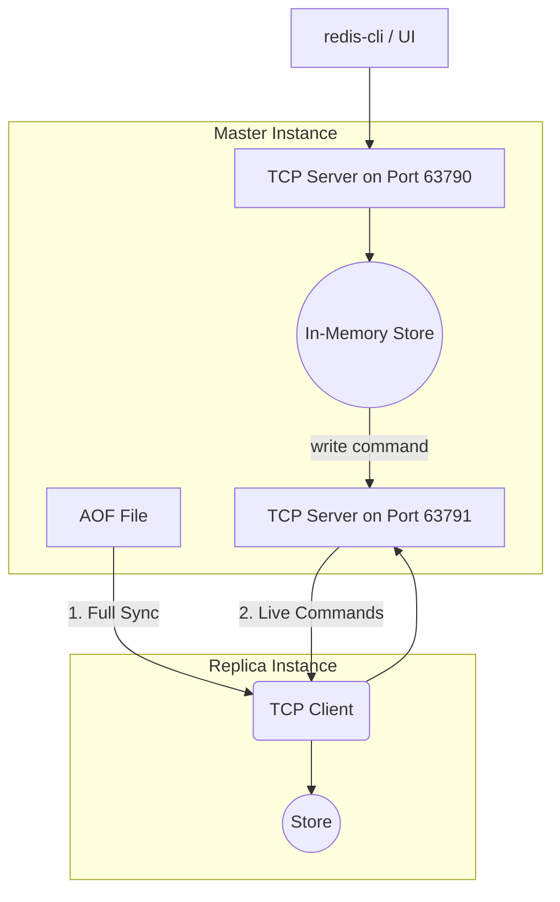

# JSRedis - A High-Performance Redis Clone & Dashboard


### A fully-featured, Redis-compatible server built from scratch in Node.js, featuring advanced data structures, master-replica replication, and a real-time observability dashboard built with React.

[](https://opensource.org/licenses/MIT)
[](https://nodejs.org/)
[](https://reactjs.org/)
[](https://www.docker.com/)

---

## 📋 Table of Contents

- [About The Project](#about-the-project)
- [✨ Core Features](#core-features)
- [🛠️ Tech Stack](#tech-stack)
- [🚀 Getting Started](#getting-started)
- [🏛️ Architecture Deep Dive](#️-architecture-deep-dive)
  - [Module Communication Flow](#module-communication-flow)
  - [Replication Workflow](#replication-workflow)
- [✅ Testing & Performance](#-testing--performance)
  - [Testing Strategy](#testing-strategy)
  - [Benchmark Results](#benchmark-results)
- [🧠 Key Challenges & Learning](#-key-challenges--learning)
- [⚖️ Design Trade-offs](#️-design-trade-offs)
- [🔮 Future Improvements](#-future-improvements)

## 📖 About The Project

JSRedis is not just a key-value store; it's a comprehensive exploration into the inner workings of modern, high-performance database systems. Built entirely from scratch with no external database dependencies, this project demonstrates a deep, practical understanding of:

-   **Low-Level Networking:** Implementing a network protocol (RESP) and managing TCP/WebSocket servers.
-   **Advanced Data Structures:** Building and managing an in-memory store with a custom LRU eviction policy.
-   **Distributed Systems:** Designing and implementing a master-replica replication model.
-   **Full-Stack Development:** Creating a decoupled backend and a real-time frontend dashboard.
-   **Professional DevOps Practices:** Fully containerizing the application for reproducible, one-command deployments.

This project's primary goal is to serve as a testament to the skills required to build, test, and deploy robust, production-ready software.

## ✨ Core Features

### Server Engine

- ✅ **Multi-Client TCP Server:** Built with Node.js's `net` module, capable of handling multiple concurrent clients.
- ✅ **RESP Protocol Implementation:** A from-scratch parser for the Redis Serialization Protocol, supporting the commands needed for client and replica communication.
- ✅ **AOF Persistence:** An Append-Only File system logs every write command, ensuring data durability across server restarts.
- ✅ **TTL Expiration:** A dual-strategy system for key expiration:
    - **Passive Expiration:** On-access check and deletion of expired keys.
    - **Active Expiration:** A background process that periodically samples and evicts expired keys to reclaim memory.

### Advanced Capabilities

- ✅ **LRU Eviction Policy:** Enforces a configurable `maxmemory` limit by evicting the Least Recently Used keys. Implemented with a highly efficient doubly-linked list and hash map for O(1) complexity.
- ✅ **Master-Replica Replication:** A server can be configured as a read-only replica of a master. The master performs a full AOF sync on initial connection and then streams all subsequent write commands in real-time.

### Real-Time Web Dashboard

- ✅ **Interactive Terminal:** A true terminal experience built by directly integrating the `@xterm/xterm` library into React, bypassing outdated wrappers.
- ✅ **Live Key Browser:** Displays all keys in the store, updating instantly via a WebSocket push protocol when data changes on the server.
- ✅ **Live Metrics Dashboard:** Visualizes real-time server performance (Commands/sec, Memory Usage, Client Count) with live-updating charts.
- ✅ **Full Containerization:** The entire full-stack application is orchestrated with Docker Compose for a simple, one-command launch.

## 🛠️ Tech Stack

| Category      | Technologies                                                                          |
| ------------- | ------------------------------------------------------------------------------------- |
| **Backend**   | Node.js, `net` (TCP), `ws` (WebSockets), Jest                                         |
| **Frontend**  | React, Vite, Tailwind CSS, `@xterm/xterm`, `recharts`                                 |
| **DevOps**    | Docker, Docker Compose, Nginx                                                         |

## 🚀 Getting Started

Thanks to containerization, running the entire JSRedis stack is incredibly simple.

### Prerequisites

-   [Docker Desktop](https://www.docker.com/products/docker-desktop/) installed and running on your machine.

### Installation & Launch

1.  Clone the repository:

    ```sh
    git clone https://github.com/AyushPandey4/jsredis-project
    cd jsredis
    ```

2.  Build and run the services using Docker Compose:

    ```sh
    docker-compose up --build
    ```

    *(Use the `-d` flag to run in the background)*

3.  **That's it!** The application is now running:

    -   **React UI:** Available at `http://localhost:3000`
    -   **JSRedis Server (for `redis-cli`):** `localhost:63790`
    -   **JSRedis Replication Port:** `localhost:63791`

## 🏛️ Architecture Deep Dive

### Module Communication Flow

The backend is designed with decoupled modules that communicate via a central `EventEmitter`, preventing circular dependencies and promoting maintainability.

-   `index.js`: The main orchestrator. Parses command-line arguments to decide whether to start as a **Master** or **Replica**.
-   `server.js`: Manages the TCP servers for both regular clients and incoming replica connections.
-   `ws-server.js`: Manages the WebSocket server, acting as a bridge to the UI. Listens for events from the `emitter` (e.g., `metrics-update`, `keyspace-update`) and broadcasts them to UI clients.
-   `handlers.js`: The application's "brain." It maps parsed commands to their corresponding logic in the `Store`. For write commands, it emits events for other modules to consume.
-   `store.js`: The data layer. Manages all in-memory data, TTLs, and the LRU eviction logic. It is implemented as a singleton instance.
-   `emitter.js`: A simple, shared `EventEmitter` instance that acts as the central message bus for the backend.

### Replication Workflow

Replication is achieved through a clean, two-port system on the master to unambiguously distinguish between regular clients and replicas.



## ✅ Testing & Performance

### Testing Strategy

A multi-layered testing approach was used to ensure correctness and robustness:

**Unit Tests:** Jest was used to test critical, pure-logic modules in isolation, such as the RESP Parser (testing for correct handling of various data formats) and the Store (testing TTLs and data manipulation).

**Integration Tests:** A dedicated test suite (integration.test.js) was created to test the system as a whole. These tests spawn the server as a child process and use a custom TCP client to verify end-to-end command sequences and, most importantly, prove that data correctly persists across a full server restart by reading the AOF file.

### Benchmark Results

Performance was measured using a custom-built, direct TCP benchmark client (benchmark-final.js) to assess the raw performance of the containerized server.

**Test Parameters:** 50 concurrent connections over a 10-second duration.

| Command         | Requests/sec (RPS) | p50 (Median) Latency | p99 Latency |
| --------------- | ------------------ | -------------------- | ----------- |
| SET key value   | ~17,000            | ~2.3 ms              | ~6.0 ms     |
| GET key         | ~15,000            | ~2.8 ms              | ~8.1 ms     |


(Results captured on a consumer-grade machine. Performance demonstrates the efficiency of Node.js's event loop for I/O-bound tasks.)

## 🧠 Key Challenges & Learning

This project involved overcoming several complex technical challenges, which were critical to its success:

**Challenge:** React & Imperative Libraries: The most popular React wrappers for xterm.js were outdated and incompatible with React 19.

**Solution:** Instead of downgrading, I built a custom React component from scratch that directly manages the xterm.js instance using useRef and useEffect. This provided a robust, future-proof solution and demonstrated a deeper understanding of React's lifecycle.

**Challenge:** Docker Environment vs. Local: The server crashed inside Docker due to subtle differences in the Current Working Directory (CWD) between npm run and docker run, leading to MODULE_NOT_FOUND errors.

**Solution:** The Dockerfile was re-architected to create a flat, predictable file structure in the final image, and the CMD was adjusted accordingly. This fixed the pathing issues and stabilized the container.

**Challenge:** Asynchronous Race Conditions: The benchmarking and integration test scripts were initially unreliable, failing with ECONNREFUSED errors because the test clients would try to connect before the server process was truly ready.

**Solution:** The startup-checking logic (waitForServer) was rebuilt to actively poll the server's port, guaranteeing the server was ready to accept connections before the tests proceeded.

**Challenge:** Decoupling Backend Modules: The initial replication logic created a circular dependency between the server and command handler modules.

**Solution:** This was resolved by leaning into an event-driven design. The command handler now emits a generic propagate event, which the server module listens for, cleanly breaking the circular require.

## ⚖️ Design Trade-offs

**Single-Threaded Model:** Like Redis and Node.js, the server is event-driven and single-threaded. This simplifies the design by avoiding complex locking, but it means a single long-running command can block the event loop.

**LRU Eviction:** A classic O(1) LRU policy was chosen for its balance of performance and effectiveness. While ideal for many use cases, it may not be optimal for workloads involving large, infrequent scans.

**AOF Durability:** The AOF currently uses synchronous writes (fs.appendFileSync) to ensure maximum data integrity, especially for tests. A production system would offer configurable fsync policies (always, everysec, none) to allow users to trade durability for higher write throughput.

## 🔮 Future Improvements

-   More Data Types: Implement LISTS, HASHES, and SETS to achieve greater compatibility with Redis.
-   RDB Snapshotting: Add the ability to create point-in-time snapshots of the dataset for faster restarts with large amounts of data.
-   Clustering (Conceptual): Implement a simple client-side sharding mechanism or a server-side proxy to explore the concepts of distributing data across multiple JSRedis instances.