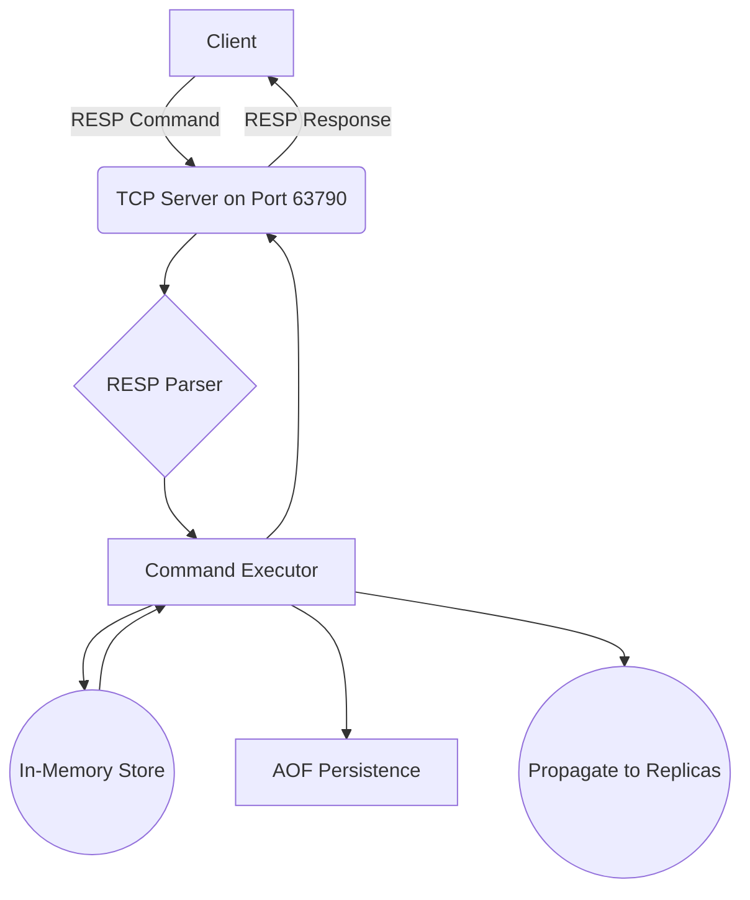

# JSRedis - A Redis-like Server & Real-Time Dashboard


JSRedis is a high-fidelity, Redis-compatible server built from scratch in Node.js, complete with a sophisticated real-time web dashboard for observability and interaction.

This project demonstrates a deep, practical understanding of core computer science principles including networking, data structures, distributed systems, and full-stack application architecture.

---

## ✨ Features

### Core Server Engine

- ✅ **TCP Server:** Handles multiple concurrent clients using Node.js's native `net` module.
- ✅ **RESP Protocol Implementation:** Custom parser for the Redis Serialization Protocol (v2), including streaming data and partial reads.
- ✅ **In-Memory Data Store:** Efficient key-value storage using JavaScript `Map`s for `STRING` data types.
- ✅ **Data Persistence (AOF):** Append-Only File persistence ensures data durability. All write commands are logged and replayed on startup.
- ✅ **TTL Expiration:**
  - **Passive Expiration:** Keys checked and deleted on access.
  - **Active Expiration:** Background process periodically samples and deletes expired keys to prevent leaks.

### Advanced Features

- ✅ **LRU Eviction Policy:** Enforces `maxmemory` with O(1) eviction using a doubly-linked list + hash map.
- ✅ **Master-Replica Replication:** Master streams full AOF and live updates to replicas for redundancy and read scaling.

### Real-Time Web Dashboard

- ✅ **Full-Stack Application:** Modern React UI communicates with the server in real time.
- ✅ **Interactive Terminal:** True terminal experience using `@xterm/xterm`.
- ✅ **Live Key Browser:** Displays all keys and updates instantly via WebSocket push.
- ✅ **Live Metrics Dashboard:** Real-time charts for Commands/sec, Memory Usage, Clients using `recharts`.
- ✅ **Full Containerization:** Run the entire stack with `docker-compose up`.

---

## 🛠️ Tech Stack

- **Backend:** Node.js, `net`, `ws` (WebSockets), Jest
- **Frontend:** React, Vite, Tailwind CSS v4, `xterm.js`, `recharts`
- **DevOps:** Docker, Docker Compose, Nginx

---

## 🚀 Getting Started

### Prerequisites

- [Docker Desktop](https://www.docker.com/products/docker-desktop/) installed and running.

### Installation & Launch

```bash
git clone <your-repo-url>
cd jsredis
docker-compose up --build
```

React UI → http://localhost:3000

JSRedis Server (TCP) → localhost:63790

Replication Port → localhost:63791

---

## 🏛️ Architecture Deep Dive

### 1. Core Server Flow



### 2. Replication Flow

```mermaid
graph TD
    subgraph Master
        M_Store((Store))
        M_AOF[AOF File]
    end

    subgraph Replica
        R_Store((Store))
    end

    M_AOF -->|1. Full Sync (Entire File)| R_Store;
    M_Store -->|2. Live Commands| R_Store;

    Client[Write Client] --> M_Store;
    ReadClient[Read Client] --> R_Store;
```

### 3. TTL Expiration Strategy

Passive Expiration: On key access, expired keys are deleted and null returned.

Active Expiration: Background process periodically samples keys with TTLs and deletes expired ones.

---

## ⚖️ Design Trade-offs

Single-Threaded Model: Like Redis, the server is event-driven and single-threaded → simple, no locks, but one slow command can block others.

LRU Eviction: Classic O(1) LRU eviction policy → general purpose but may evict hot keys under some workloads.

Durability vs. Performance: Current AOF uses fs.appendFileSync → maximizes durability but slower. A production system would offer configurable fsync policies (always, everysec, none).

---

## 📊 Performance Benchmarks

Benchmarks with 50 concurrent connections on the containerized server:

| Command         | Requests/sec | p50 Latency | p99 Latency |
| --------------- | ------------ | ----------- | ----------- |
| SET key value   | ~17,000      | ~2.3 ms     | ~6.0 ms     |
| GET key         | ~15,000      | ~2.8 ms     | ~8.1 ms     |

(Results depend on host machine.)